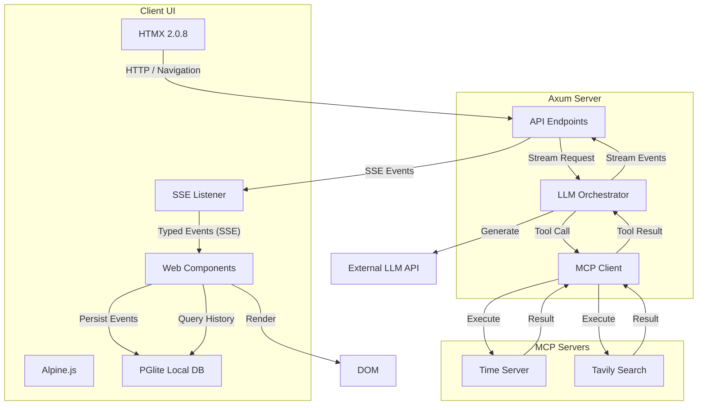

# Axum + Leptos + HTMX + Web Components

## Agentic Streaming LLM Application (MCP-First, Tauri-Ready)

This repository is a reference implementation and living architecture example for building agentic AI applications that:
*   support tool-first LLM interaction
*   stream rich, typed model output
*   remain HTML-first and inspectable
*   avoid heavyweight SPA frameworks
*   run identically as:
    *   a web app
    *   a desktop app (via Tauri)
    *   a mobile app (via Tauri)

This is not a demo toy.
There are no mocks.
Everything is wired against real protocols, real streaming, and real tools from day one.

---

## High-Level Goals

This project exists to prove (and then serve as a template for):

1.  **Always-on tool use with LLMs**
    *   The server is always an MCP client
    *   Tools are discovered dynamically from mcp.json
    *   The model can call any tool at any time
    *   Tool execution is deterministic and server-controlled
2.  **First-class streaming**
    *   Token streaming
    *   Tool call streaming
    *   Tool result streaming
    *   Structured chunk types (thinking, reasoning, citations, memory, errors)
    *   A future-proof AG-UI-style event model
3.  **Local-First Persistence**
    *   **PGlite** (Postgres in WASM) for complete client-side history
    *   Full-text search running in the browser
    *   Offline-capable architecture
4.  **Protocol flexibility without UI changes**
    *   OpenAI Chat Completions
    *   OpenAI Responses
    *   OpenAI-compatible backends (Ollama, vLLM, etc.)
    *   One internal event contract for the UI
5.  **HTML-centric UI composition**
    *   HTMX 2.0.8 for navigation and server interaction
    *   Web Components for client-side programmability
    *   Alpine.js for local UI reactivity
    *   No React, Next.js, Vue, or SPA routers

---

## Architecture Overview

---

## Core Design Principles

### 1. Tools Are Non-Optional

This system assumes:
*   The model will call tools
*   The model should reason with tools
*   The model cannot execute tools itself

Therefore:
*   The server is always an MCP client
*   Tools are discovered dynamically at startup
*   Tools are available to every request
*   Tool execution is deterministic, auditable, and server-side

---

### 2. Streaming Is the Default

All LLM interaction supports:
*   streaming responses
*   streaming tool calls
*   streaming tool results

The server normalizes all upstream streaming into a single internal event model, regardless of whether the upstream protocol is:
*   Chat Completions
*   Responses
*   OpenAI-compatible proxies

The client never has to care which protocol is used.

---

### 3. One Internal Event Contract

Internally, everything becomes typed events:
*   `message.delta`
*   `tool_call.delta`
*   `tool_call.complete`
*   `tool_result`
*   `error`
*   `done`

In parallel, the server mirrors these events into AG-UI-style events:
*   `agui.message.delta`
*   `agui.tool_call.delta`
*   `agui.tool_call.complete`
*   `agui.tool_result`
*   `agui.error`
*   `agui.done`
*   `agui.usage` (Token counts)

This allows:
*   progressive rendering
*   structured UIs
*   future AG-UI endpoints without refactoring

---

## S-Tier UI Features

This reference implementation includes production-grade UI features:

### 1. Robust Streaming & Tool Support
*   **Flicker-Free Streaming**: Native EventSource implementation with an optimized `StreamController` ensures smooth text delivery.
*   **Unified Tool Blocks**: Multiple tool calls (e.g., Time + Search) are aggregated into clean, keyed DOM elements.
*   **No Truncation**: Specialized buffering logic ensuring markdown and code blocks are always complete.

### 2. Context-Aware Auto-Naming
*   **Background Generation**: Automatically names conversations after the first turn using a dedicated LLM call.
*   **Contextual**: Uses both the user prompt and the assistant's reply for accurate titles.

### 3. Sidebar Polish
*   **Date Grouping**: Conversations organized by "Today", "Yesterday", "Last 7 Days", etc.
*   **Inline Renaming**: Double-click titles to rename instantly.
*   **Full-Text Search**: Search across all conversation history stored locally in PGlite.

---

## MCP (Model Context Protocol)

### Why MCP?

MCP provides:
*   a standard tool interface
*   language-agnostic tooling
*   dynamic discovery
*   isolation between model reasoning and execution

### This Project Uses:
*   `rmcp` (official Rust MCP SDK)
*   stdio child-process MCP servers
*   remote streamable HTTP MCP servers

---

## UI Stack

### HTMX 2.0.8
Used for navigation, server interaction, and progressive enhancement. Not used for high-frequency streaming updates.

### Web Components (TypeScript)
Provide a programmable client runtime for the chat interface. Components include:
*   `<chat-stream>`: Manages SSE connection and persistence.
*   `<transcript-view>`: Handles efficient DOM updates and markdown rendering.
*   `<conversation-sidebar>`: Manages history and PGlite interactions.
*   `<token-counter>`: Displays real-time usage metrics.

### PGlite (Postgres WASM)
Runs a full Postgres instance in the browser for:
*   storing conversation history
*   performing full-text search
*   ensuring offline capability

### Alpine.js
Used sparingly for local UI transitions and toggle states.

---

## Tauri Compatibility

This project is Tauri-ready by design:
*   no CDN scripts
*   all assets served locally
*   no API keys in the browser
*   SSE works identically in webview
*   same UI codebase for web + desktop + mobile

---

## Summary

This repository demonstrates that it is possible to build **deeply agentic**, **tool-first**, **streaming-native**, **HTML-centric**, **Tauri-compatible** AI applications without heavyweight SPA frameworks, without client-side secrets, and without sacrificing UX or architectural clarity.
